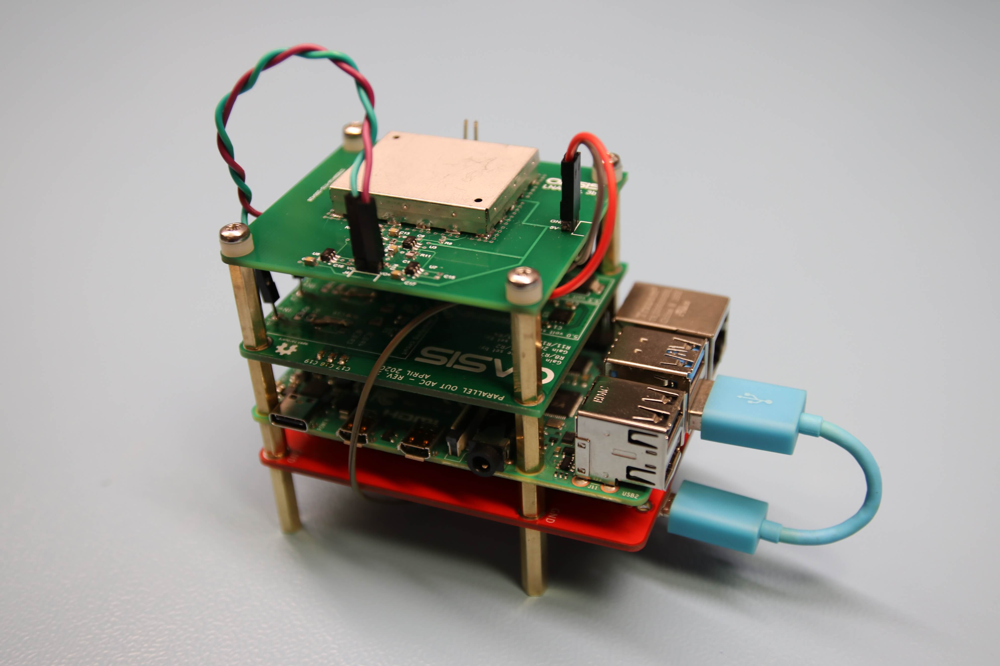

# OASIS
Contains the complete code, circuit schematics and designs for the OASIS prototype system.
The full OASIS - A low-cost modular echosounder thesis report should also be red for a better understanding if further development of the system are to be investigated.  

**CONTENT: folder and content**
- LNA_Rev3: PCB design files for the LNA board. 
- MCU_ATmega4809: Code for waveform-generation on the ATmega4809. 
- Oasis_ADC_PCB: PCB design files for the ADC board.
- Python code and drivers: Main python script and C- code drivers for the OASIS system
- SPI_test_alternative_ADC: Some code for setting up SPI communication on the Raspberry Pi.  

**HARDWARE modules:**
- LNA board - Low noise amplifier. (designed and tested)
- MCU board - ATmega4809 Full-bridge module. (designed and tested)
- ADC board - ADS8422 board Analog to Digital converter. (designed and tested)
- Raspberry pi 4 model B (4GB RAM). (bought and tested)

**OASIS Prototype achievements:** 
1. System startup: Transducer transmit a pulse at preset frequency (200kHz). 
    - Pulse generaton is done on sepparate microcontroller (MCU).  
    
2. Switch into "receive mode" - receive and sample incomming returning echo. (switch not developed) 

3. Plotting and light processing of received signal.
    - FFT: Frequency
    - Plotting: Time vs. voltage 
    
**CONTACT:** 
- Martin Ericsson: 
- Tor K. Gjerde - tlf: 46934462 email: torkg@stud.ntnu.no
- Torbjørn: 
- Einar Avdem: 

