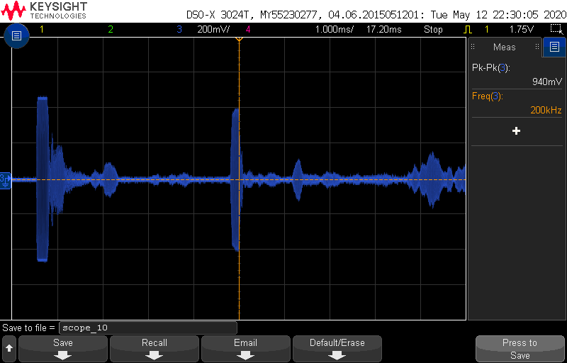

# OASIS
Project folder for code, circuit schematics and design of the OASIS prototype system

HARDWARE modules used: 
- LNA - Low noise amplifier. 
- MCU - ATmega4809 Full-bridge module.
- ADC - ADS8422 board Analog to Digital converter.  
- Raspberry pi 4 model B (4GB RAM).

OBJECTIVES: 
1. Start the sonar system, transducer transmit chirp signal at preset frequency. 
    - Pulse generaton is done on sepparate microcontroller (MCU).  
    
2. Switch into "receive mode" - receive and sample incomming returning echo. 

3. Plotting and light processing of received signal.
    - FFT: Frequency
    - Plotting: Time vs. voltage 

